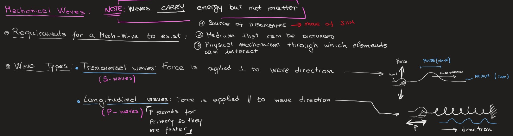

Document file containing all the informations, links to the notes and unfiltered advices coming from the experience gathered during my bachelor.

I've decided to create this document as I've always been the "Go-to" person when in need of anything accademically related. I've therefore decided to set my peers and the new students up for success by trying and sharing whatever I had in one easily accesible place. 

The document has had so far over 400 visualizations and most of the notes count about almost the same amount of downloads!

You can see my UNFILTERED guide here: <a href="/src/Thesis/Eng_Guide"><i class="large github icon "></i>Engineering Guide by Nikolas Vitaliti</a>