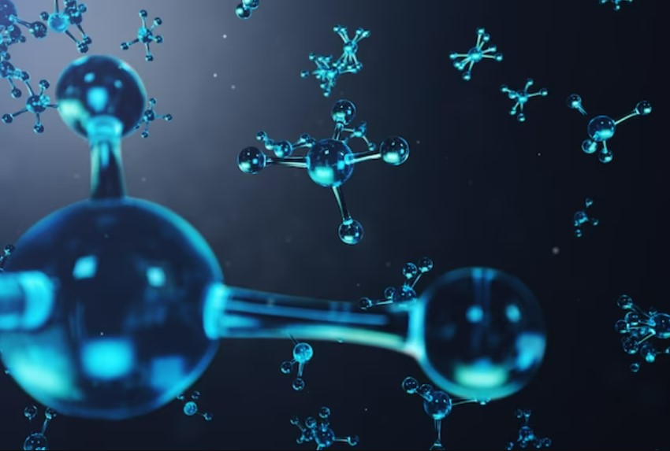

The project was divided in two main parts: 

For the first part, the reaction energy of water splitting using different functionals (LDA, PBE, PBEsol, RPBE) in LCAO and PW mode was calculated. In this way, a better understanding on the best method and functional to be used could be investigated. Moreover, by analyzing the DATA, a clear overview of the best accuracies with respect to the experimental value could be determined. 

For the second part, the catalytic properties of different surface were calculated instead. Main parts of the tasks performed were: 

- Building a Ru and a Cu 2x2x3 FCC(111) using the ASE module and adding an hydrogen atom in the FCC hollow site. Performing a convergence test for k-points and cutoff energy using the PBE functional in the PW mode for said slabs.
- Performing a convergence test of the size of the slabs keeping the parameters selected to see if the slabs sizes were "Good enough".
- Cycling through the different functionals to understand which would give the most accurate adsorption energy on the respective slabs.
- Cycling through all the different adsorption sites of both the slabs to investigate the adsorption energy differences.
- Constructing a Ru surface and replace the top layer with Cu atoms. Calculate the adsorption energies, and understanding why are they different with respect to the case of pure Ru and pure Cu.

A small part of the code can be seen below, in which the adsorbate was put in different sites of the Cu slab and energies were calculated.

 ```cpp
 # Run through the configurations with a H adsorbate
for position in ['ontop','longbridge','shortbridge','hollow']:
    parprint('Relaxing {}'.format(position))
    atoms = slab.copy()  # Make a new clean copy
    
    add_adsorbate(slab=atoms, adsorbate='H',
                  height=1.5, position=position)
    name = 'H-'+position
    
    calc = GPAW(txt='relax-Cu110_' + name + '.txt', **settings)
    
    atoms.calc = calc
    relax = BFGS(atoms, trajectory='relax-Cu110_' + name + '.traj',
                 logfile='relax-Cu110_' + name + '.log')
    relax.run(fmax=0.05)
    calc.write('Cu110_' + name + '.gpw')
    energies_slab[position] = atoms.get_potential_energy()

# Get energies for H2 we calculated earlier
with paropen('energies_ex2.pckl', 'rb') as f:
    energies = pickle.load(f)

# Calculate adsorption energies
e_ontop = energies_slab['ontop'] - energies_slab['clean'] - 1/2. * energies['H2', 'PBE']
e_bridge = energies_slab['longbridge'] - energies_slab['clean'] - 1/2. * energies['H2', 'PBE']
e_fcc = energies_slab['shortbridge'] - energies_slab['clean'] - 1/2. * energies['H2', 'PBE']
e_hcp = energies_slab['hollow'] - energies_slab['clean'] - 1/2. * energies['H2', 'PBE']
 ```

Presentation of the results can be seen here ---> <a href="/src/Modelling/Final Project.pptx"><i class="large github icon "></i>Final Project</a>
