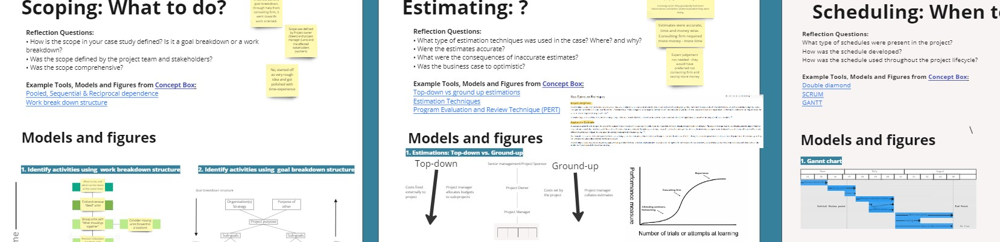

A thorough analysis have been carried out by me and 5 other colleagues of a project from the international fastening technology company "Titgemeyer". The Miro Board tool has been used to keep track of the gathered informations, and a small preview is given in the image above.

The analysis has been carried out following the project management principles, scheduling interviews with both the CEO and the Project Manager to get further insight on the project itself and by using differnt models and tools. 
This has been presented by sectioning the study into the 4 most important perspectives:

 - Purpose
 - People
 - Complexity
 - Uncertainty

Finishing off with a nice "Connecting the dots" part, where everyting is carefully evaluated to give an overview of the success of the project, along with some suggestions based on the group studies and the overall conclusions.

The report ---> <a href="/src/Project_Management/Group30_RestorageTitgemeyer_s223455_NikolasVitaliti.pdf"><i class="large github icon "></i>See the report</a>
