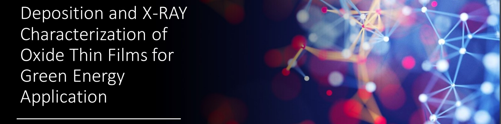

The thesis has focused on the characterization and investigation of micro-Fuel Cells, and in particular on the Oxide thin film that is supposed to be in between the anode and the cathode.

The research and experiments have been carried out at the Pulsed Laser Deposition (PLD) Lab. of Rome Tor Vergata, with the help of the PLD team and my supervisor Prof. Simone Sanna.

Here I have learned to:

- Operate the vacuum chambers and pumps and set the correct order of magnitude of vacuum inside the latter, such that the amount of impurities and oxygen would be minimized for the deposition of the different substrates.
- Setup and carry out the deposition of said substrates (STO, SAO, SDC), along with the ability to analyze and study the quality of such deposition by using the Reflection High Energy Electron Diffraction (RHEED) technique.
- Separate and detach the SDC substrate from the STO by dissolving the salt layer.
- Analyze the final substrate by X-Ray Diffraction (XRD) analysis, utilizing both the complex machine and software for the mentioned means.

Furthermore, I have acquired slightly more specific knowledge in the fuel cells field, along with the choice of materials for such devices.

My thesis ----> <a href="/src/Thesis/EngineeringSciences_Thesis.pdf"><i class="large github icon "></i>See Thesis Report</a>

My presentation ----> <a href="/src/Thesis/Presentazione"><i class="large github icon "></i>See Presentation</a>
